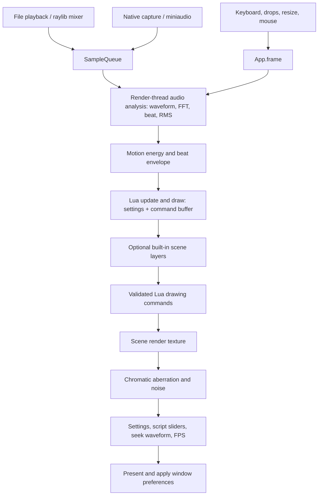

# Architecture

zigscene is a Zig 0.16 application with raylib rendering/audio, a custom immediate
mode GUI, and an embedded Lua 5.4 scene runtime. Native and Emscripten builds use
the same application, scene, and UI code. Lua controls scene composition and
animation through a bounded API; Zig owns the window, audio devices, GPU state,
playback controls, and resource lifetime.

## Frame flow



[`src/main.zig`](src/main.zig) parses the CLI and owns the native app lifetime.
The web entry point keeps an `App` in module storage and registers its frame
callback with Emscripten. [`App.zig`](src/App.zig) owns the audio session, script
controller, render texture/shader, camera/input state, and visualizer history.

Each `App.frame`:

1. Updates audio playback and applies volume, then processes input and resizes the
   render texture if necessary.
2. Drains up to four fixed audio blocks and advances the motion envelope.
3. Builds a Lua context from the latest analysis and input, polls any watched
   script, runs update/draw under protection, and commits valid settings changes.
4. Advances built-in visualizer history when built-in rendering is enabled.
5. Renders the built-in layers (unless replaced) and the Lua command buffer into
   the scene texture.
6. Clears/composites the window, applies the post-processing shader, draws the UI
   and diagnostics, presents, and applies changed FPS, opacity, and topmost state.

No Lua runs on audio/device threads. `destroy` closes Lua and restores its
settings, stops audio, releases the renderer and UI caches, then closes raylib.

## Module map

| Area | Responsibility |
| --- | --- |
| [`src/core/config.zig`](src/core/config.zig) | Mutable host settings and built-in GUI control metadata |
| [`src/core/cli.zig`](src/core/cli.zig) | Audio/capture flags and `--scene=path` parsing |
| [`src/core/input.zig`](src/core/input.zig) | Keyboard shortcuts, Lua/audio drop routing, resize, camera gestures |
| [`src/core/event.zig`](src/core/event.zig) | Direct tab/resize/swipe dispatch helpers |
| [`src/core/init.zig`](src/core/init.zig) | Window/audio startup and alpha-compositing setup |
| [`src/audio/Session.zig`](src/audio/Session.zig) | Playback/capture/seek transitions and user notices |
| [`src/audio/processor.zig`](src/audio/processor.zig) | Mono waveform smoothing, FFT, RMS and beat detection |
| [`src/graphics.zig`](src/graphics.zig) | Built-in visualizer exports and resize handling |
| [`src/graphics/Motion.zig`](src/graphics/Motion.zig) | Frame-rate independent energy/beat envelope |
| [`src/shader/shader.zig`](src/shader/shader.zig) | Scene texture and embedded GLSL shader lifetime |
| [`src/gui.zig`](src/gui.zig) | Tabs, panel scrolling/resizing, controls, player and seeking |
| [`src/gui/theme.zig`](src/gui/theme.zig) | Palette, font atlases, logical UI scale and matching hit coordinates |
| [`src/core/debug.zig`](src/core/debug.zig) | FPS/frame timing and CPU-stage diagnostics |
| [`src/scripting/Scene.zig`](src/scripting/Scene.zig) | Lua VM lifetime, transactional reload, file watching and setting ownership |
| [`src/scripting/lua_scene.c`](src/scripting/lua_scene.c) | Protected Lua execution, validation and bounded commands/context |
| [`src/scripting/settings.zig`](src/scripting/settings.zig) | Stable script paths mapped to typed host setting pointers/ranges |
| [`src/scripting/render.zig`](src/scripting/render.zig) | Converts validated commands to raylib calls |
| [`src/gui/ScriptPanel.zig`](src/gui/ScriptPanel.zig) | Example/reload controls, errors/messages and script parameter sliders |

## Audio and the seek waveform

File playback uses raylib's mixed-audio callback. Live capture uses a thin C
miniaudio adapter; `capture.zig` bridges it into Zig. `SampleQueue` transfers
stereo PCM into fixed 1,024-frame blocks so device callbacks do not execute FFT,
GUI, Lua, or GPU work. Switching sources resets analysis state. The render
thread bounds its analysis work to four blocks per frame.

The live waveform, FFT, RMS and beat state describe the latest analyzed block.
Motion applies attack/release smoothing, gain/compression and an exponential beat
pulse. Lua gets copies of these values in reused Lua tables, including smoothed
mono samples and the first half of the linear FFT magnitude array. Lua never
receives pointers into the audio queue.

The playback/seek waveform is a separate whole-file preview, built by
[`WaveformPreview.zig`](src/audio/WaveformPreview.zig). It preserves peaks and RMS
in up to 8,192 bins and analyzes bass/mid/high bands using filters at the source
file's sample rate. [`WaveformCache.zig`](src/gui/WaveformCache.zig) aggregates
those bins at display resolution and caches their geometry in a texture. Playback
progress and seeking draw over that cache; ordinary frames do not rescan the
track. Track revision and display dimensions invalidate the cache.

## Lua boundary

The public C ABI is in [`lua_scene.h`](src/scripting/lua_scene.h). Zig sees an
opaque `ZsScene` pointer and plain setting, parameter, context, and drawing-command
structs. The bridge has no Zig callback pointers.

This separation is deliberate: Lua raises errors using `longjmp`. Lua API calls
that can raise, including script compilation and setup, occur inside a C
`lua_pcall` boundary. A jump never unwinds a Zig stack frame or crosses a Zig
`defer`. Errors are copied to a bounded string before returning to Zig.

The VM opens only base/math/string/table/utf8. Host I/O, dynamic loading,
metatable access and coroutine/debug APIs are excluded. A custom allocator caps
Lua heap usage at 16 MiB. Instruction hooks budget setup and each frame; the hook
continues raising after exhaustion, even if a script tries to catch it. Source,
parameter, string and draw-command counts have additional fixed bounds.
These are containment and responsiveness measures, not a hard real-time guarantee
or an isolation boundary for hostile code. C standard-library operations are not
preempted by a Lua instruction hook.

### Settings ownership and reload

The registry maps stable lowercase paths such as `halo.radius` and
`window.always_on_top` to typed Zig pointers. It snapshots current values for Lua
and supplies exact numeric ranges and Boolean type information. Lua writes go
into its private snapshot and dirty mask. The host commits those writes only
after successful protected execution.

The controller records the original value when a script first writes a setting.
Unloading restores only those owned settings. A reload builds its candidate from
the pre-script baseline, allowing removed config keys to release their overrides.
Slider values are copied by ID and clamped to the candidate's range.

Reload creates a separate candidate VM. If compilation, config validation, or
setup fails, the current VM continues running and its settings remain unchanged.
If initialization succeeds, the old VM is destroyed, its settings restored, and
the candidate's settings committed. Runtime update/draw errors discard that
frame's commands/writes, unload the failed VM, restore its settings, and resume
the built-in scene. The failed source stays selected for retry.

File watching reads at most 1 MiB every 0.75 seconds and compares a content hash.
This detects multiple edits within the same filesystem timestamp interval and
avoids recompiling unchanged content. Failed content is remembered too, avoiding
repeated compilation every frame. Manual reload bypasses the hash. Embedded
examples use exactly the same loader without filesystem watching.

### Rendering contract

Scripts choose `mode = "overlay"` or `"replace"`. Overlay draws after the built-in
layers; replace skips them. Lua drawing calls only append validated commands:
there are no GPU calls while Lua runs. Invalid command arguments never append a
partial command, including errors caught with Lua `pcall`.

The Zig renderer consumes the completed buffer in order within the scene texture.
It controls all `BeginMode3D`/`EndMode3D` pairs, so scripts cannot leave the camera
or draw state unbalanced. A `camera` command changes later custom 3D draws within
that frame; otherwise they use the host camera. There is no persistent camera
state hidden in the command buffer. Textures, meshes and shader handles are not
exposed to Lua in the current interface.

The scene texture then passes through the existing shader. UI draws afterward,
so replacing a scene does not replace playback or settings controls. Source-over
alpha uses separate RGB/alpha blend factors, preserving an opaque destination
when background opacity is 1. Window opacity remains a separate OS-level control.

## UI and window settings

Widgets request cursor shapes during drawing. The theme applies the final shape
once, only when it changes; resetting the native cursor between widgets caused
per-frame arrow/hand switching and repeated GLFW cursor allocation on hover.

The UI draws in logical coordinates using a scale transform. Mouse coordinates,
scissor rectangles and panel geometry use the same scale. Font atlases are baked
at the largest supported UI scale and reused across size changes. Window minimums
and panel constraints keep controls reachable when resized. Horizontal/vertical
panel resizing and whole-UI scale are independent preferences.

Scene parameters reuse the common slider interaction with a separate ID range.
The scripting panel's measured height offsets the built-in layer list and its
hover/highlight mapping. Errors wrap and contribute to scroll height. Script
reloads replace parameter storage only between frames or after that frame's
parameter loop is skipped.

Settings are session-local. Lua config files provide an explicit reusable startup
configuration, but changing a slider does not rewrite a script. FPS 0 means
uncapped. **Always on top** defaults to the app's previous behavior (on); changing
it applies/clears raylib's native topmost flag without recreating the window.
Browser builds disable that control.

## Builds, dependencies and tests

[`build.zig`](build.zig) attaches raylib, optional Tracy, and Lua to the native
app/tests and to the web library. Lua source is pinned by URL and Zig package hash
in [`build.zig.zon`](build.zig.zon). [`deps/build/lua.zig`](deps/build/lua.zig)
compiles only the Lua core and exposed libraries plus the C bridge; no system Lua
or interpreter executable is needed. Lua's license is bundled in
[`docs/licenses/Lua.txt`](docs/licenses/Lua.txt).

Development builds retain Zig Debug checks while compiling raylib and Lua with
ReleaseSafe optimization. This avoids per-vertex/backend work and interpreter
work dominating development FPS. `-Draylib-optimize=Debug` opts into raylib's
unoptimized backend.

Emscripten links the Zig application, raylib, and Lua archives through
[`deps/build/emcc.zig`](deps/build/emcc.zig). Lua C compilation enables Emscripten
setjmp/longjmp lowering; this is required for its protected error boundary in
WebAssembly. See [Emscripten's setjmp support](https://emscripten.org/docs/porting/setjmp-longjmp.html).
The web target remains experimental and is outside this overhaul’s validation
scope. Script loading is guarded on Emscripten: Lua scenes currently run only in
the native app. Live native capture and native window management are also
unavailable in the browser.

```sh
zig build                 # native build
zig build run             # native development app
zig build check           # native build plus both test roots
zig build test            # headless unit tests
zig build web -Dtarget=wasm32-emscripten -Doptimize=ReleaseSafe \
  --sysroot "$EMSDK/upstream/emscripten"
```

The main test root includes audio, GUI geometry/highlighting, diagnostics and Lua
integration tests. `audio_test.zig` is an independent test root for the queue,
CLI, motion and geometry. Lua integration tests execute the real C bridge without
opening a window: lifecycle/context updates, settings/parameter rollback, failed
reloads, file watching, invalid drawing, instruction/memory limits, library
restrictions, and all bundled examples. GPU/window behavior still needs a native
or browser smoke test.

## Extending the interface

For a new host setting, add its Config storage/UI control as needed and register
its stable name, pointer, type and range in `scripting/settings.zig`; update the
[script reference](docs/scripting.md). Prefer keeping names stable for saved
scripts.

For a new drawing primitive, add a command kind to `lua_scene.h`, validate and
encode its arguments in `lua_scene.c`, and implement its raylib dispatch in
`scripting/render.zig`. Keep Lua errors inside C and all graphics lifetime/state
management inside Zig. Add headless validation tests and a visual example.
